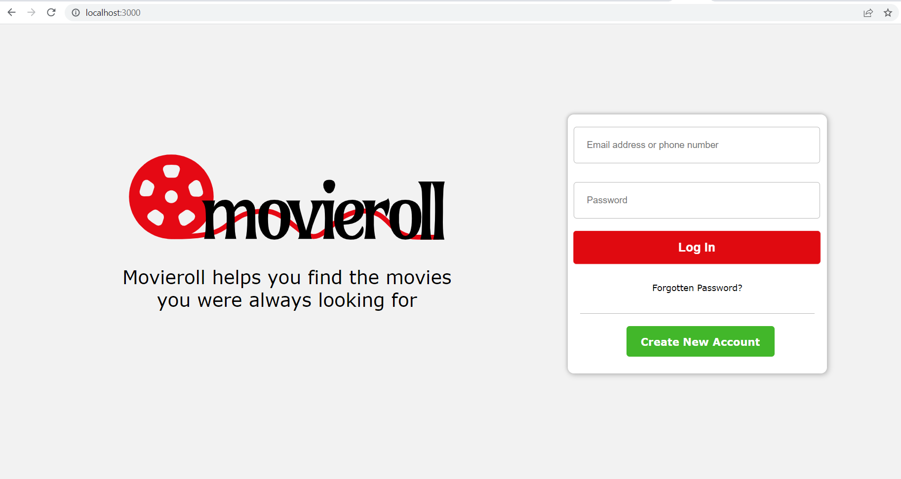

# Movie API Project 

## Overview 
This repository contains the implementation of Movie API. 
The main aim of this application is to allow users to get details of movies based on the inputted criteria such as title, 
description, rating, release date, Genre etc. 

## Design
The UML diagram for the application is in the UML folder which gives an overview of the classes and screens implemented. 

The application is designed using below technologies:

1. Front end UI is developed using React js 
2. Middleware API creation is done using Java,SpringBoot and Spring Data JPA 
3. Postgres Database has been used for storing the data

## Implementation

The Movie API is designed in such a way that a user who want to get details of any movies from the database can register using 
the registration page. The registered user can login to the application using their emailid and password and send an 
authentication request to get an authorization token which is valid for a specific amount of time. The generated token can be
used to send requests for any of the API data that the user want to access.

The application has following modules: 

1. User:
   
   This module provides API related to  user operations such as User registration and authentication based on his emailid and password. The user should
   be able to register and login to application with the help of user endpoints. User should also be able to update his details like
   email id and password if required. 

2. Movie:
   
   This module provides API related to Movies. A registered user should be able to access the movies API and get data based on
   few attributes such as movie title, description, release date, rating, genre, original language,poster,adult,runtime.A User can 
   get movie data based on a single attribute or multiple attributes by using the movie endpoints.

3. Admin:

   This module provides API related to admin operations which includes both managing users and movies. An admin should be able to add 
   a new user, update the role of a user, update user details and delete user details. Admin should also be able to add a new movie, 
   update the details of existing movie and delete a movie with the help of admin endpoints.

The source of movie database is the external API called TMDB API which has been consumed to get the data into movie database. 
An external API called Twilio API is used to send an sms notification to the registered user when he requests for some data in 
the application.

## Output

After starting the application the screen where user can login should look like below: 

Login Screen 

The details of how to access each of the end points is provided at the url below:

http://localhost:8080/swagger-ui/index.html

## Instructions to run 

To run this project you need to fork the repository to your git account and clone it to your machine. 

#### Pre-Requisites: 

You need to have the following softwares installed on your machine.
1. Java (above version 8) 
2. Eclipse/Intellij IDE for Java/Sprigboot 
3. Visual Studio Code for React 
4. Postgres SQL

#### Steps to run the project: 

1. Set up postgres database on your machine by following the steps below:

   Step 1: 

   Start the postgres server using the following command
   _pg_ctl -D "<<path to postgres>>" start_

   Step 2: 

   Use below command to go to postgres SQL Editor in command prompt 
   _psql -U postgres -h localhost -W_ 
   At this stage you will be asked to enter password that you have created while installing the postgres.

   Step 3: 

   When you see postgres=# in the command prompt then use below commands to create a user and a database as follows:

   _create user springuser with password 'password';_

   _grant usage, select on all sequences in schema public to springuser;_

   _grant select,update,insert,delete on table users,movies to springuser;_

   _create database movies;_ 

2. Once the database is ready navigate to MovieApiApplication.java and run the application as Springboot application. 
   You should see that the application run as a springboot application on embedded tomcat server and you will be able to 
   access all the endpoints for user,movies and admin based on the roles.

3. To run application tests go to the terminal and use below command
   mvn test
   You should be able to see all the tests running successfully.

## Future Improvements 

1. To add actors and directors information in the movie database so that user can get data based on actors and directors.
2. To add age checks for movie data 

